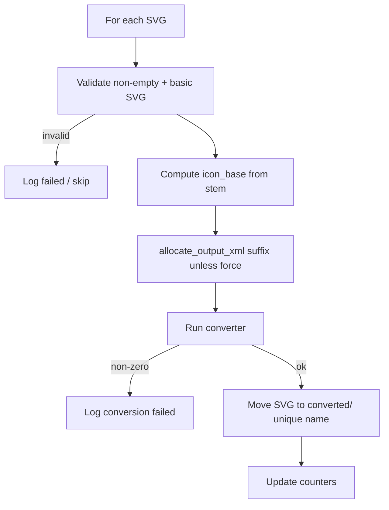

> **Repository copy** of the original Cursor plan for the SVG → Compose Python pipeline (plan id: `svg_icon_pipeline_script`).  
> **Note:** This plan assumed **`svg2vd`** CLI; the **current** implementation in this repo uses **`vd-tool`** via `npx` in [svg_icons_to_compose_resources.py](../svg_icons_to_compose_resources.py) at the **repository root**. Naming rules, collision suffixes, SVGO explicit paths, and `finalize_vector_xml_bytes` behavior in the script still align with the intent below where applicable.

# SVG → VectorDrawable Python pipeline (archived plan)

## Context

- Paths were specified **relative to the repo root** (or overridable via constants / `argparse` in the script).
- Early draft referenced **`svg2vd`** (`npx svg2vd`); replaced in implementation by **`vd-tool`** for Android Studio–compatible output.

## Script design

### Paths and discovery

- **Source dir**: `icons-src/` — at repository root (sibling of `composeApp/`), not under `composeApp/src/**`, so it stays outside Compose `composeResources` and default Android `res/` merges.
- **Output dir**: `composeApp/src/commonMain/composeResources/drawable/`
- **Converted dir**: `icons-src/converted/`
- **SVG enumeration**: only `icons-src/*.svg` (non-recursive) so `icons-src/converted/**` is never picked up.

### Build packaging — `icons-src` must not ship on Android or iOS

- **Why**: Raw SVGs under a packaged tree could end up in merged resources; only generated **VectorDrawable XML** should ship under `composeResources/drawable/`.
- **Android safeguard**: `android { packaging { resources { excludes += "**/icons-src/**" } } }` in `composeApp/build.gradle.kts` (if present in your KMP host).

### Pipeline order (SVGO + conversion)

1. Discover **top-level** SVGs only.
2. Run SVGO **only on explicit file paths** (never blind `svgo -f icons-src/` that could touch `converted/`).
3. Iterate the same list for conversion.

### Per-file flow

### Naming (`icon_base_from_stem`)

1. `stem.startswith("ic_")` → `icon_base = stem`
2. `stem.startswith("ice")` → `ic_` + stem
3. `stem.startswith("icon")` → `ic_` + stem
4. `len(stem) > 2` and `stem.startswith("ic")` and `stem[2] != "_"` → `ic_` + `stem[2:]`
5. Else → `ic_` + stem

Then **normalize** for Android `[a-z0-9_]*`, handle collisions with `_1`, `_2`, … unless `--force`.

### Move after success

Only after successful conversion: move source to `icons-src/converted/` with unique name if needed.

### Logging and summary

Per-file lines + final totals: found, converted, moved, collision suffix count, failed, skipped invalid.

## Deliverable (as originally scoped)

- Python script (now [svg_icons_to_compose_resources.py](../svg_icons_to_compose_resources.py) at repo root).
- Optional Gradle exclude for mistaken `icons-src` under Android module.

## Audit notes from original plan

- Drawable name validation after rules.
- Zero-byte output = failure, do not move.
- Preflight for Node/Java depending on chosen tools.

---

## Original Cursor todos (completed in that track)

- Add script with argparse, SVGO on explicit paths, per-file conversion, `--force`, collision suffixes, moves, validation, naming rules, summary logging.
- Keep `icons-src/` at repo root; Gradle packaging excludes for `**/icons-src/**` where applicable.
- Optional agent skill documenting the command.
