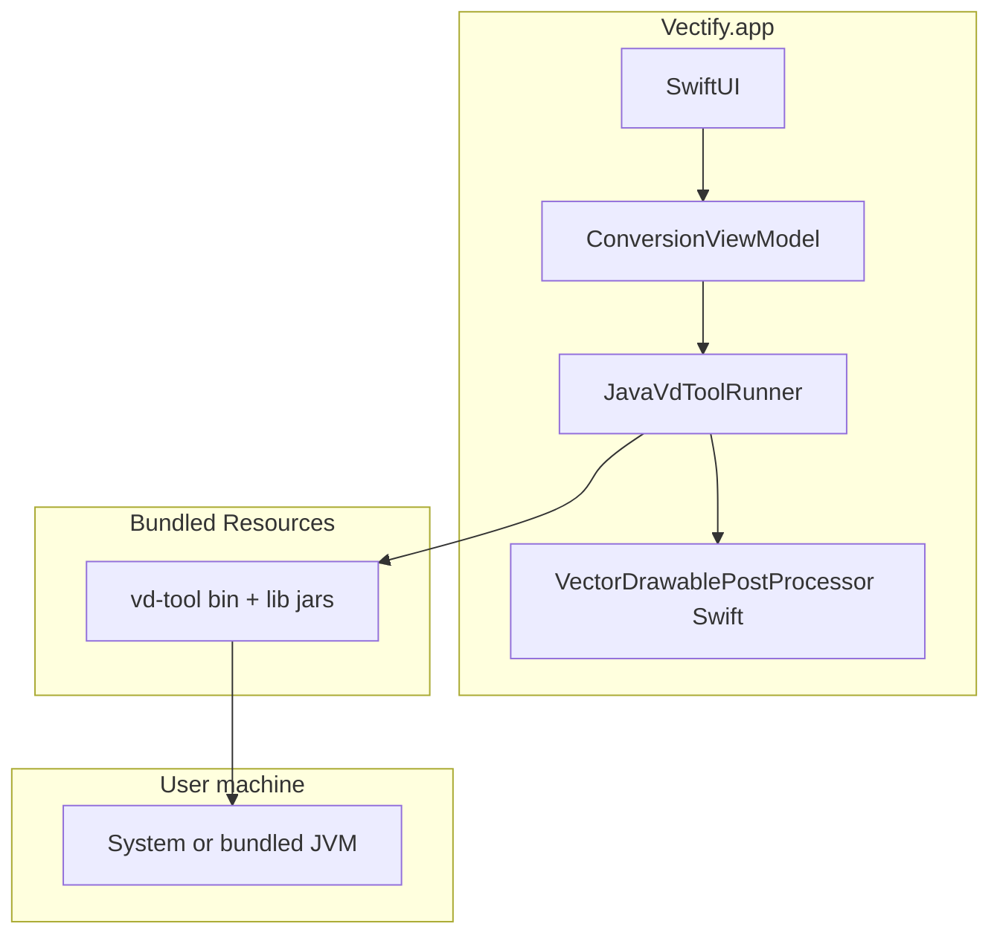

> **Repository copy** of the Vectify macOS + DMG + Compose plan. Consolidated for this project (Cursor plan id: `svg2xml_dmg_compose_app`).

# Vectify — macOS DMG plan (restructured after critique)

## 1. Outcome

Ship **Vectify.app** (SwiftUI) inside a **DMG**, so designers and developers can convert **SVG → Android `vector` XML** suitable for **Kotlin Multiplatform Compose** `commonMain/composeResources/drawable/` (Android + Compose on iOS consume the same resource shape; feature subset on iOS is a support concern, not a different file format).

**Non-goals (unless explicitly added later):** Mac App Store listing (different entitlement and review bar), native iOS Asset Catalog workflow, automatic installation of Java/Node on the user’s machine.

---

## 2. Critical review — what the earlier plan underplayed or assumed

| Challenge | Why it matters | Mitigation |
|-----------|----------------|------------|
| **npm `vd-tool` vs GitHub `bin/vd-tool`** | We relied on a Gradle-style launcher; the **exact** npm tarball layout must match what you ship. | **Gate 0**: `npm pack vd-tool@<pin>` → inspect `package/bin` + `package/lib`; run one conversion; checksum vendor tree in git or CI artifact. |
| **vd-tool maintenance** | Last npm publish **2021**; may diverge from latest Android Studio importer. | Document “Studio parity as of vd-tool x.y.z”; revisit upgrades deliberately. |
| **“Any user” vs Java** | Vendoring **only** `bin`+`lib` still requires **a JVM** unless you bundle a JRE. | Explicit **distribution tiers** (§4); UI copy must not promise zero installs unless tier B. |
| **GUI `PATH` / `JAVA_HOME`** | macOS apps see a **minimal environment**; `java` may work in Terminal but not from `Process`. | Set env in wrapper; probe `/usr/libexec/java_home`; document Temurin/Zulu. |
| **Quarantine & executables** | Resource scripts may not be `+x`; downloaded vendor zips can be quarantined. | Build script sets permissions; ad-hoc sign vendor shell if needed; test **signed** Debug/Release. |
| **App Sandbox** | Current [Vectify.entitlements](../Vectify/Vectify/Vectify.entitlements) is **read-only user files** — cannot write outputs or keep flexible subprocess behavior without more entitlements or **no sandbox**. | Decide early (§4); validate subprocess **before** UI polish. |
| **Script vs app semantics** | [svg_icons_to_compose_resources.py](../svg_icons_to_compose_resources.py) **moves** SVGs out of the **input folder** into `icons-src/converted/` — surprising for arbitrary paths. | GUI defaults: **do not move** files from the input folder; optional “archive / move after success” for power users. |
| **Two implementations of post-process** | Python `finalize_vector_xml_bytes` + Swift port risks **drift**. | Shared **golden-file tests**; treat diff failures as release blockers. |
| **SVGO** | Nice for size; not required for correctness; pulls in **Node**. | MVP **SVGO off**; add optional path later. |
| **Bundling Python** | “Invoke system python3 + script” still fails for many users. | **Not** MVP; keep Python for **CI/developers** after path decouple. |

---

## 3. Source of truth today

- Pipeline: SVGO (optional) → **vd-tool** `-c` → **post-process** ([finalize_vector_xml_bytes](../svg_icons_to_compose_resources.py)) → write XML.
- Repo-centric paths in Python (`icons-src`, `composeApp/.../drawable`, move, archive) — **decouple** for the app (§8).
- Starter UI: [Vectify.xcodeproj](../Vectify/Vectify.xcodeproj), entry point [VectifyApp.swift](../Vectify/Vectify/VectifyApp.swift).

---

## 4. Distribution tiers (pick one as the shipping default)

| Tier | DMG contains | User installs | Best for |
|------|----------------|----------------|----------|
| **A (recommended default)** | `vd-tool` **`bin/` + `lib/`** (pinned) | **JDK/JRE 8+** | Balance of size and support |
| **B** | Tier A + **bundled JRE** (license review) | Nothing | True consumer “double-click” |
| **C (dev)** | App only | Java + **global/`npx` vd-tool** + optional Node for SVGO | Fastest first iteration |

**DMG does not auto-install Java or npm packages** — Tier A/B must spell prerequisites in README + in-app Environment screen.

**Acquire vendor tree (not from `/bin`)**: `npm pack vd-tool@<pin>` → `package/bin`, `package/lib` → copy into `Contents/Resources/Vendor/vd-tool/` preserving layout (**both** `bin` and `lib`).

**vd-tool CLI** (unchanged contract): `vd-tool -c -in <svg> -out <existing-dir>` [npm docs](https://www.npmjs.com/package/vd-tool).

---

## 5. Target architecture (single spine)

- **Optional later**: SVGO via Node; **optional**: call refactored Python for batch/CI.

---

## 6. Phased delivery (with gates)

| Phase | Scope | Gate (do not proceed until) |
|-------|--------|-----------------------------|
| **0 — Verify toolchain** | Pin vd-tool; vendor layout; one CLI conversion from bundled paths; Java detection from a minimal Swift `Process` test | Signed or unsigned reproducible XML sample matches known-good |
| **1 — MVP app** | **Input folder** + **output folder** pickers, **no SVGO**, bundled vd-tool Tier A, Swift post-process, **Repair** (input folder of XML), log, no move of input files | Golden tests vs Python on same fixtures (allowing ordering whitespace if documented) |
| **2 — UX + Stitch** | Apply Stitch tokens; Environment screen; error states; collision naming aligned with Python rules if you port that logic | Design review against Stitch |
| **3 — Optional SVGO** | Node detection, skip default, config file picker | Explicit opt-in; no regression on MVP tests |
| **4 — Ship** | DMG layout, README, Developer ID, notarization, staple | Clean install on clean VM / second Mac |

**Run in Xcode**: open [Vectify/Vectify.xcodeproj](../Vectify/Vectify.xcodeproj), scheme Vectify, destination My Mac, ⌘R.

---

## 7. Swift module checklist (Vectify target)

- `JavaVdToolRunner` — working directory, env, args; create `-out` dirs like Python.
- `VectorDrawablePostProcessor` — port `finalize_vector_xml_bytes`.
- `PrerequisiteChecker` — `java -version` / `java_home`.
- `ConversionViewModel` — security-scoped URLs, async work, cancellable batch.
- **Naming** — reuse or port `icon_base_from_stem` / collision rules from Python for consistent `ic_*` outputs.

---

## 8. Python / repo hygiene (parallel to app)

- Refactor [svg_icons_to_compose_resources.py](../svg_icons_to_compose_resources.py): explicit **input folder** (SVGs) and **output folder** (drawable XML) arguments or config; **move/archive off by default** for library-style use; keep CLI for CI.
- Optional `--config` JSON for automation; **no requirement** that the Mac app shells to Python for v1.

---

## 9. Validation

- Fixtures: stroke-only, missing viewBox, collisions, batch N>40 (SVGO chunking only if SVGO on).
- **Diff** app output vs Python vd-tool+finalize path.
- Optional: drop XML into minimal KMP project — Android + iOS Compose smoke.

---

## 10. UI specification (screen by screen)

Global: **macOS single window** (min ~900×600), standard toolbar where noted, **Window** menu (minimize/zoom). **Help** → About, Environment. Optional **View** → toggle log panel height. Use **SF Symbols** for toolbar icons (folder, play, wrench, stethoscope, doc.text).

### Screen A — Convert (primary)

**Purpose:** Pick an **input folder** (SVGs) and an **output folder** (XML), set options, run batch conversion, inspect results.

**Layout (top → bottom):**

- **Toolbar:** “Choose input folder…”, “Choose output folder…”, primary **Convert** (disabled until the input folder contains ≥1 `.svg` and the output folder is writable), optional **Stop** when running.
- **Input folder row:** Label **Input folder**; path as truncated `NSString` style middle-elide; **Reveal in Finder**; optional drag-and-drop zone (same as choosing the input folder).
- **Output folder row:** Label **Output folder**; optional helper line for Compose projects: “Typical: `…/composeResources/drawable`”; path + Reveal; **Create output subfolder** if you offer a one-tap `drawable` assist under the chosen output path (optional).
- **Options (grouped):**
  - Toggle **Apply SVGO first** (default off for MVP); when on, sub-row: optional config file picker.
  - Toggle **Overwrite existing XML** (maps to `--force`); off = auto `_1`, `_2` suffixes like Python.
  - Toggle **Move processed SVGs to a subfolder** (default **off**); if on: name field default `converted` or picker.
  - Toggle **Archive XML copy** (default off); if on: choose parent folder or use timestamped folder next to output.
- **Summary strip:** “N SVG found” after scan; updates after run.
- **File list (table):** Columns — **Name**, **Status** (Queued / Running / OK / Failed / Skipped), **Output file** (click to reveal in Finder), **Message** (short error). Sort by status. Live updates during conversion.
- **Log (collapsible TextEditor / scroll view):** monospace, append-only lines from subprocess + app; **Clear log**, **Copy log**.

**Empty / edge:** No **input folder** or no **output folder** selected → helper text “Choose an **input folder** that contains `.svg` files and an **output folder** for XML.” Input folder has no SVGs → inline warning in summary strip, Convert disabled.

### Screen B — Convert (running state)

Same as Screen A with: **progress** in toolbar or window title (“3 / 12”); **Stop** enabled; table rows show **Running** on current file; global **indeterminate bar** optional; controls that change paths/options **disabled** until finished or stopped.

### Screen C — Convert (completed state)

Same layout; toolbar **Convert** enabled again; summary: “Converted X, failed Y, skipped Z”; optional **Export summary** (plain text) for bug reports.

### Screen D — Repair drawable XML

**Purpose:** Batch-fix existing `<vector>` XML (viewport / stroke-fill logic matching `finalize_vector_xml_bytes`).

**Layout:**

- **Toolbar:** “Choose input folder…”, **Repair all**, **Stop**.
- **Explanation** (1–2 lines): what gets fixed; warn that files are **modified in place** (or offer “write to copy folder” if you add safe mode later).
- **Input folder row:** folder whose `.xml` files contain `<vector>` (often a Compose `drawable` directory); Reveal.
- **Table:** file name, **Changed** yes/no, short note; **Log** panel as on Convert.

**Empty:** No **input folder** → Repair disabled; no matching XML → message “No `.xml` files with `<vector>` found in the input folder.”

### Screen E — Environment (diagnostics)

**Purpose:** Pre-flight for support and power users.

**Layout:**

- **Section Java:** Row **Java found** (green) / **Not found** (red); show `java -version` first line if OK; path from `/usr/libexec/java_home` if present; buttons **Copy diagnostics**, **Open Temurin** (URL) or **Copy brew install command**.
- **Section vd-tool:** **Bundled** (green) with version pin string, OR **External** path if dev tier.
- **Section Node (optional):** Only if SVGO path enabled — same pattern as Java.
- **Section Sandboxing / permissions:** Short line: “Read/write: user-selected folders only” or “App not sandboxed” per build.

### Screen F — About

**Purpose:** Version, credits, compliance.

**Layout:** App icon + name + version/build; short description; **vd-tool** version and license link; **Third-party licenses** button (opens scroll view or local RTF); link **Source / issues** (repo URL).

### Screen G — Blocking gate (Java missing)

**Purpose:** First-run or post-update when JVM unusable.

**Layout:** Modal sheet or full placeholder replacing main content: icon, title “Java is required”, body 2–3 sentences, primary **Download Temurin**, secondary **Copy brew install …**, tertiary **Quit** or **Open Environment** after user installs. No Convert until dismissed and re-check passes.

### Screen H — Error / confirmation dialogs (patterns)

- **Conversion error (single file):** non-blocking; table cell shows Failed + message; optional **Retry failed** after run completes.
- **Fatal (vd-tool missing / corrupt):** alert with **Open Environment**, **Quit**.
- **Overwrite warning:** if user turns on Overwrite and output already has files, optional one-shot confirmation alert listing count.

### Navigation model

- **TabView** or **sidebar list** (Convert | Repair | Environment) + **About** via menu only, **or** single Convert view with Repair/Environment as toolbar popovers/sheets — pick one in Stitch; sidebar scales better if Repair grows.

### Stitch handoff checklist

For each screen above: frame size, light/dark, **all states** (default, loading, success, error, empty), component names matching SwiftUI structure, spacing scale (8pt grid), primary button hierarchy.

---

## 11. Open product choices (resolve before Phase 1 code freeze)

1. **Default tier**: A vs B (bundled JRE or not).
2. **Sandbox**: on + expanded entitlements vs off for v1.
3. **Naming**: strict Android `ic_*` rules vs preserve filenames.

---

## 12. Risks (residual)

- Notarization failures from **nested** scripts/binaries — fix with signing/chmod as needed.
- **Legal**: vd-tool MIT + JAR stack; bundled JRE adds vendor terms.
- User expectation: “works like Android Studio” — set expectations on **vd-tool age** and **Compose iOS subset**.

---

## 13. Stitch export — design system extraction (`stitch_svg_vector_toolbox/`)

**Sources:** [desktop_professional/DESIGN.md](../stitch_svg_vector_toolbox/desktop_professional/DESIGN.md) (tokens + rationale); dark HTML: `*_dark_mode/code.html` per screen. **Icons:** Material Symbols Outlined (web); map to **SF Symbols** in SwiftUI for native pixel grid.

**Export quality note:** `repair_tool_dark_mode/code.html` begins with corrupted markup (markdown fence inside `<body>`). Treat **repair_tool** (light) + **environment_dark_mode** / **convert_initial_dark_mode** as the reliable references for Repair.

### 13.1 Canonical dark palette (reconcile Stitch variants)

Stitch uses **two charcoal bases** across files — **unify in Swift** to one system:

| Role | Hex | Usage |
|------|-----|--------|
| **Window / main canvas** | `#121316` | `convert_initial_dark_mode` body — deepest background |
| **Elevated surface / sidebar** | `#1a1b1f` | Cards, sidebar, header strip; 80% opacity + blur in HTML |
| **Hairline border** | `white` **5–10%** opacity (`border-white/5`, `/10`) or `#414755` (`outline-variant` in token screens) | Card edges, dividers |
| **Primary action fill** | `#0070eb` | `primary-container` — active nav pill, solid buttons (“Choose”, “Copy Diagnostics”) |
| **Primary text on blue** | `#fefcff` | `on-primary-container` |
| **Accent / progress / links** | `#adc6ff` | `primary-fixed-dim` — progress text, OK row tint, subtle brand on dark |
| **Body text** | `#e2e2e6`–`#f1f0f5` | `on-surface` (use `#E3E2E7` where About uses `on-surface`) |
| **Secondary label** | `#8b91a0` / `gray-400`–`500` | Section labels, disabled |
| **Inset field / log well** | `black/20`–`black/40` | Path chips, log background |
| **Success** | `#4ade80` / `green-400` | Status OK, Java STABLE chip |
| **Error** | `#ffb4ab` (token) + `#ba1a1a` (some screens) | Failed rows, critical badges |
| **Stop / destructive** | `#ba1a1a` + `on-error` white | Running screen “Stop Processing” button |
| **Running row highlight** | `primary/10` background + `secondary-fixed-dim` / sync icon | `convert_running_dark_mode` |

**Typography (match DESIGN.md + HTML):**

| Style | Font | Size / line | Weight | Letter-spacing |
|-------|------|---------------|--------|----------------|
| App title | Inter | ~18px bold + tracking tight | 700–800 | — |
| Tagline | Inter | 10–11px | 500 | uppercase, `tracking-widest` |
| **h1** | Inter | 24px / 32px | 600 | -0.02em |
| **h2** | Inter | 18px / 24px | 600 | -0.01em |
| **body** | Inter | 13px / 20px | 400 | 0 |
| **body-sm** | Inter | 11px / 16px | 400 | 0.01em |
| **label** | Inter | 12px / 16px | 500 | 0.02em; uppercase for field labels |
| **mono / log** | Space Grotesk | 12px / 18px | 400 | 0 |

**Layout numbers (pixel-aligned to Stitch):**

- Sidebar width: **240px**
- Top bar height: **48px** (`h-12`)
- Outer margin: **24px** (`p-margin`)
- Gutter / gap: **16px** (`gap-gutter`, `gap-6` in bento)
- Card padding: **16–20px** (`p-4`, `p-container_padding` 20px)
- Corner radius: **8px** cards (`rounded-lg`); **12px** large panels (`rounded-xl`); pills **full**
- Icon: **18–20px** Material; SF Symbol **~16–20pt** equivalent
- Scrollbar (dark): **8px** track `#1a1b1f`, thumb `#414755` (from `convert_initial_dark_mode` style block)
- **Glass:** `backdrop-blur` **20–24px** + semi-transparent surface on sidebar/header

**Effects:** `mac-shadow` on decorative image: `0 0 0 1px rgba(255,255,255,0.1), 0 10px 30px rgba(0,0,0,0.4)`; optional blurred primary orb (decorative only — skip or simplify in SwiftUI).

### 13.2 Screen-by-screen layout cues (dark HTML)

| Screen | Key file | Layout summary |
|--------|----------|------------------|
| **Convert empty** | `convert_initial_dark_mode/code.html` | Sidebar + **48px** top bar (project label, Open Project, settings, disabled Convert); **2-col** **input folder** / **output folder** cards (align Stitch labels “Source/Output” to this copy); **empty state** in table (upload icon 64 circle, h2 + body); log panel with Clear/Copy |
| **Convert running** | `convert_running_dark_mode/code.html` | Top bar: **“3 / 12”** + thin **progress bar**; **bento**: 8+4 cols — disabled **input/output folder** fields + **Stop** card; full-width table (Status, Filename, Size, Target, Action); **terminal** log with traffic-light dots; **toast** bottom-right ETA |
| **Environment** | `environment_dark_mode/code.html` | Title “System Readiness” + **Copy Diagnostics**; **3-col** cards (Java, vd-tool, Node); **2-col** Quick Fixes + Security; init log |
| **Repair** | `repair_tool_dark_mode/code.html` (verify after fixing corrupt prefix) | Same shell as Convert; Repair active in nav |
| **About** | `about_dark_mode/code.html` | Centered marketing layout; version strip; third-party links |
| **Blocking Java** | `blocking_gate_no_java_dark_mode/code.html` | Full-screen **modal** over blurred fake app; primary CTA Temurin, secondary copy brew |

### 13.3 SwiftUI “pixel perfect” checklist (when implementing)

1. Add **Color assets** (or `extension Color`) for every row in §13.1; single source for `#121316` vs `#1a1b1f`.
2. Register **Inter** + **Space Grotesk** in target (bundle fonts or use system fallback with `Font.custom` + design fallback to `.system` with monospacedDigit for logs if licensing blocks bundling).
3. **NavigationSplitView** or `HStack` 240 + content; `Material.thin` / `.sidebar` for vibrancy approximation.
4. Map Material icons → SF Symbol: `transform` → `arrow.triangle.2.circlepath` or `square.2.layers.3d`; `build` → `hammer`; `settings_suggest` → `gearshape.2`; `info` → `info.circle`; `folder_open` → `folder.badge.gearshape` / `folder`; `terminal` → `terminal`; `play_arrow` → `play.fill`; `stop` → `stop.fill`; `check_circle` → `checkmark.circle.fill`; `sync` → `arrow.triangle.2.circlepath` with rotation.
5. **Toggle** style: sidebar footer in `convert_initial` uses **pill track** 32×16 — replicate with `Toggle` + `.toggleStyle(.button)` or custom `Capsule` 8×16 track.
6. Match **disabled** Convert: `bg-white/5 text-gray-600` → opacity ~38% primary label.

### 13.4 Pixel parity disclaimer

True **pixel-perfect** match to Tailwind-in-browser is not possible in native AppKit (font rasterization, blur, 1px hairlines differ). Goal: **same spacing, hierarchy, colors, and component states** as Stitch dark screens.

---

## 14. Implementation order (UI)

1. Shell: **240 sidebar** + **48 top bar** + dark colors.  
2. **Convert** empty + filled + running states.  
3. **Environment** + **Blocking gate**.  
4. **Repair** + **About**.

---

## Workstream todos (tracking)

| ID | Task |
|----|------|
| verify-vd-tool-layout | Pin vd-tool version; npm pack and diff bin+lib; checksum vendor tree; CI fetch step |
| distribution-tier | Choose ship tier A/B/C; legal review if bundling JRE |
| sandbox-decision | Sandbox + user-selected RW vs no sandbox; signed build subprocess test |
| stitch-spec | Stitch frames; export tokens for SwiftUI |
| swiftui-mvp | **Input folder** + **output folder** pickers, bookmarks, log, Convert + Repair without SVGO |
| java-vd-wrapper | `Process` + JAVA_HOME/PATH; bundled `bin/vd-tool` + `lib/` |
| postprocess-swift-tests | Port `finalize_vector_xml_bytes`; golden diff vs Python |
| svgo-optional | Node path optional; do not block MVP |
| script-decouple | Python path args + CI; optional JSON driver |
| dmg-notarize | Archive, DMG, codesign, notarytool, staple, README |
